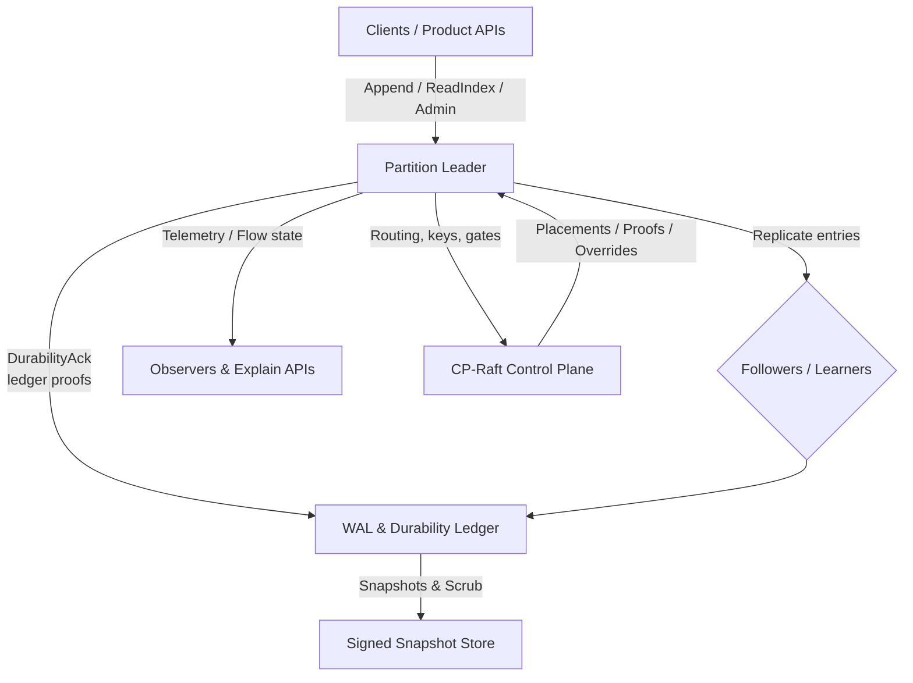
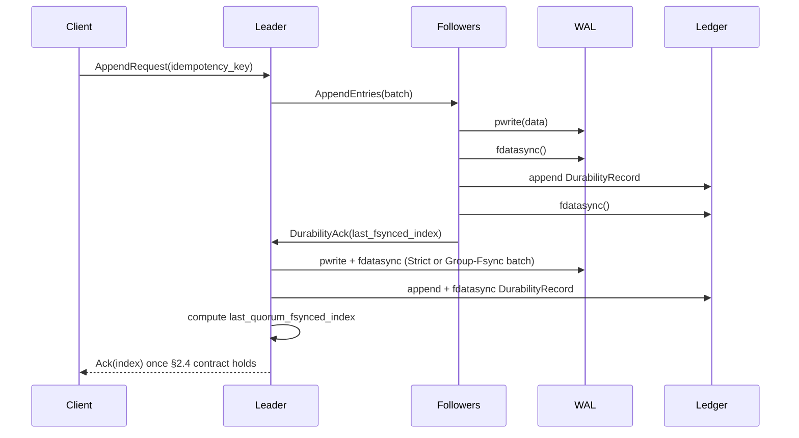

# Clustor – Raft Replication Substrate

Clustor is a safety-first, Rust-based Raft substrate that ships as a reusable library crate plus sidecar utilities. It provides a normative, auditable replication kernel for products that need linearizable writes, crash-deterministic recovery, explainable throttling, and a hardened control plane. The specification in `docs/specification.md` defines every wire byte, durability invariant, and operational guardrail so that implementations stay provably correct.

---

## Why Clustor?

- **Normative consensus core** – §0 of the spec defines the invariants (log matching, durability, linearizable reads) that every release must satisfy; spec-lint regenerates the machine-readable wire catalog and fails builds on drift.
- **Deterministic durability** – WAL ordering, Group-Fsync guardrails, and a quorum durability ledger (`wal/durability.log`) keep acknowledged writes crash-proof and auditable.
- **Explainable operations** – PID-based flow control, structured throttle envelopes, and Why*/CpUnavailable schemas make it easy to diagnose availability or credit issues.
- **Snap-ready storage** – Signed, AEAD-protected snapshots with manifest authorization handshakes allow safe compaction and state transfer.
- **Hardened control plane** – CP-Raft manages placements, durability proofs, key epochs, feature gates, and break-glass workflows with strict caches and telemetry.

---

## High-Level Architecture



- **Partition Leaders** accept writes, enforce `strict_fallback_state`, and serialize WAL → `fdatasync` → `wal/durability.log` ordering.
- **Followers** mirror the same durability steps before replying with `DurabilityAck{last_fsynced_index,...}` so the leader can reconstruct quorum evidence.
- **CP-Raft** distributes routing epochs, durability proofs, key epochs, and override ledgers; data-plane nodes fall back to Strict mode when caches go stale.
- **Storage** combines segment MAC trailers, Merkle leaves (profile-controlled), AEAD encryption, and signed snapshots for repairable, explainable persistence.

---

## Repo Layout

- `src/` – library source (control_plane, replication, persistence, observability).
- `tests/` – integration suites grouped by domain plus shared helpers in `tests/support/`.
- `.context/` – backlog, audit snapshots, and design notes consumed by the Codex agents.
- `docs/` – specification, architecture, and dependency references.
- `tools/` – local gates (`ci.sh`, `forbid_src_tests.sh`, `inventory.sh`, `audit.sh`) that mirror CI behavior.

---

## End-to-End Append Flow



This sequence highlights the §5.5 happens-before chain and ACK contract (§2.4): no acknowledgement leaves the leader until the WAL bytes, durability ledger, and quorum evidence are all durably recorded.

---

## Key Capabilities

- **Flow Control & Backpressure** – Dual-token buckets and PID loops per partition (with profile-specific gains) expose `WhyCreditZero` and throttle envelopes (<32 KiB JSON).
- **Snapshots & State Transfer** – Canonical manifests (RFC 8785 JSON + Ed25519 signatures), AEAD-authenticated chunk streams, bounded import buffers, and manifest authorization logs prevent TOCTOU errors.
- **Security & Isolation** – mTLS/SPIFFE for every RPC, AEAD-encrypted WAL/snapshots with nonce reservation accounting, and RBAC/Break-Glass workflows tied to CP-ledgered overrides.
- **Telemetry & Spec Self-tests** – Golden signals (`clustor.*` metrics), incidents, and startup spec-self-tests that regenerate `wire_catalog.json`, `chunked_list_schema.json`, the wide-int catalog, and fixture bundles to catch drift.

---

## Public API Surfaces

The library crate re-exports the major surfaces described below so downstream users do not need to reach into internal modules.

- **Snapshots (`snapshot-crypto`)** – `snapshot.rs` now fronts the manifest/pipeline/throttle/telemetry modules, re-exporting `SnapshotManifest*`, `SnapshotTrigger*`, `SnapshotChunk*`, `SnapshotExportController`, `SnapshotImport*` errors, and `SnapshotThrottle*` envelopes for state transfer and guardrails.
- **Security & RBAC (`admin-http`)** – `security.rs` exposes `Certificate`, `SerialNumber`, `MtlsIdentityManager`, `KeyEpochWatcher`, plus RBAC/break-glass helpers (`RbacManifest*`, `BreakGlass*`, `SecurityError`) that remain feature-gated with Admin HTTP support.
- **Admin Workflows (`admin-http`)** – `AdminService`, `AdminHandler`, and the structured request/response types (`SnapshotThrottleRequest`, `TransferLeaderRequest`, etc.) are exported so callers can wire the workflows without depending on private modules.
- **Control-Plane Guarding** – `CpProofCoordinator`, `CpGuardError`, `ReadIndexPermit`, `CpUnavailableResponse`, and `StrictFallbackSnapshotImport*` records define the guard/circuit-breaker API that callers use to reason about CP connectivity and fallback states.
- **Management HTTP (`management`)** – consolidated `/readyz`, `/why`, and `/admin` routing behind one mTLS listener; see `docs/management.md`.

---

## Storage I/O Configuration

Both the Raft log and the durability ledger are configurable so operators can pick the right encoding/IO pipeline for their environment:

- `CLUSTOR_LOG_ENCODING` (default `json`) controls the **Raft log** segment encoding. `binary` enables the compact frame format persisted per segment; manifests track the chosen encoding so mixed-version clusters can reopen the same storage layout without manual migration.
- `CLUSTOR_WAL_CODEC` (default `json`) controls the **durability ledger** (`wal/durability.log`). JSON is human-readable and backwards-compatible, while `binary` emits fixed-width frames (37 bytes each) that avoid parsing overhead on high-throughput quorum machines.
- Both writers use the shared `SharedBufferedWriter` abstraction so `pwrite → flush → fdatasync` ordering remains deterministic regardless of encoding. Flush thresholds (`WAL_FLUSH_THRESHOLD`, `DURABILITY_LOG_FLUSH_THRESHOLD`) can be tuned at compile time if your platform needs different batching.

If you flip either environment variable, make sure the nodes serving the same storage directories agree on the setting; otherwise they will reject the on-disk files during startup because the manifest/headers will not match the codec they expect.

---

## Feature Flags

The crate ships with **no default features enabled**. Enable only what you need:

- `net` – pulls in the blocking HTTP parser/servers plus TLS (`rustls`). Required for CP transport, Raft networking, Readyz/Why servers, etc.
- `admin-http` – builds the admin workflows, RBAC/break-glass helpers, and Admin HTTP server (requires `net` when you actually host the server).
- `snapshot-crypto` – enables the full snapshot pipeline (AEAD chunking, manifest signing, fallback controllers, follower-only reads).
- `async-net` – opt-in async shims (Tokio) layered on top of the blocking net stack.
- `http-fuzz` – exposes the manual HTTP parser fuzz harness (implies `net`).
- `full` – convenience umbrella for `net`, `admin-http`, `snapshot-crypto`, and `async-net`. Use `--features full` for the complete experience that CI exercises.

Example builds:

```bash
# Minimal core (no net/admin/snapshot)
cargo check --no-default-features

# Full feature set
cargo test --features full

# Net + Readyz but no admin/snapshot
cargo build --no-default-features --features net

# CI feature matrix
make feature-matrix
```

`make feature-matrix` runs the combinations our CI cares about:

1. `cargo check --no-default-features`
2. `cargo test --no-default-features --features net`
3. `cargo test --no-default-features --features net,admin-http`
4. `cargo test --no-default-features --features net,snapshot-crypto`
5. `cargo test --all-features`

---

## Lint & Testing Policy

- `make ci` runs `tools/ci.sh`, which enforces `cargo fmt --all -- --check`, `RUSTFLAGS=-Dwarnings cargo test --all-targets`, `cargo clippy --all-targets -- -D warnings`, the `tools/forbid_src_tests.sh` gate, and the async-runtime check (`tools/check_async_runtime.sh`) to ensure only Tokio APIs are used.
- `clippy.toml` enables `warn-on-all-wildcard-imports` and disallows `dbg!` / `println!` in tests, keeping lint behavior reproducible across workstations.
- Local `#[allow(...)]` attributes are reserved for unavoidable cases (`clippy::too_many_arguments` on builder APIs, deprecated crypto traits, etc.); new allowances should come with comments explaining the tradeoff.

---

## Getting Started

1. **Read the Spec** – `docs/specification.md` is the single source of truth for invariants, wire formats, and operational guardrails.
2. **Implement or Embed** – Use the Rust library crate plus sidecar utilities described in the spec; enforce the same `strict_fallback_state` and ledger ordering rules in your runtime.
3. **Operate with Guardrails** – Follow the documented runbooks (e.g., CP outage behavior, disk hygiene, quarantine lifecycle) to keep durability proofs and telemetry aligned.
