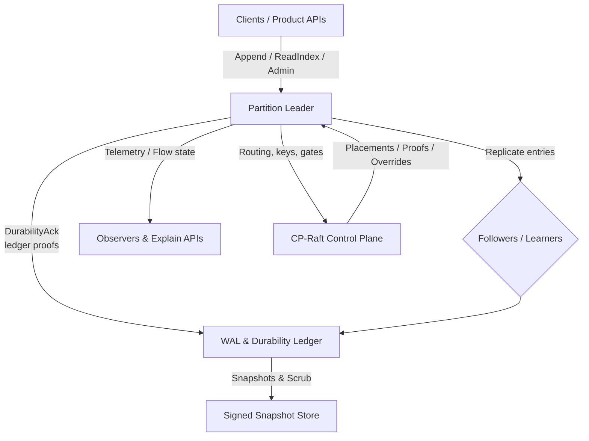
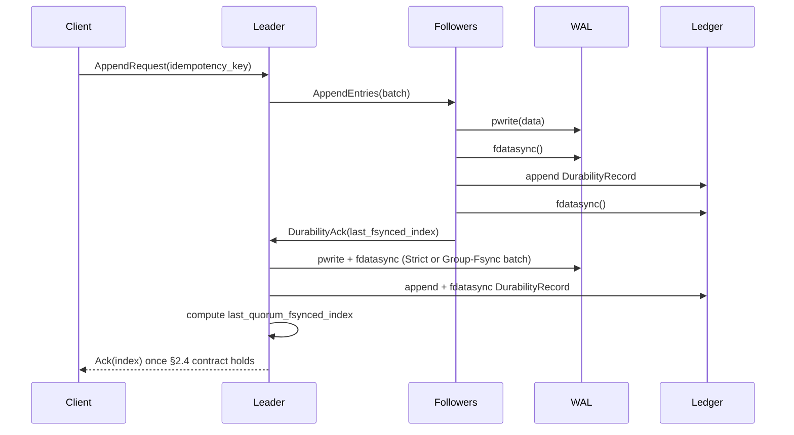

# Clustor – Raft Replication Substrate

Clustor is a safety-first, Rust-based Raft substrate that ships as a reusable library crate plus sidecar utilities. It provides a normative, auditable replication kernel for products that need linearizable writes, crash-deterministic recovery, explainable throttling, and a hardened control plane. The specification in `docs/specification.md` defines every wire byte, durability invariant, and operational guardrail so that implementations stay provably correct.

---

## Why Clustor?

- **Normative consensus core** – §0 of the spec defines the invariants (log matching, durability, linearizable reads) that every release must satisfy; spec-lint regenerates the machine-readable wire catalog and fails builds on drift.
- **Deterministic durability** – WAL ordering, Group-Fsync guardrails, and a quorum durability ledger (`wal/durability.log`) keep acknowledged writes crash-proof and auditable.
- **Explainable operations** – PID-based flow control, structured throttle envelopes, and Why*/CpUnavailable schemas make it easy to diagnose availability or credit issues.
- **Snap-ready storage** – Signed, AEAD-protected snapshots with manifest authorization handshakes allow safe compaction and state transfer.
- **Hardened control plane** – CP-Raft manages placements, durability proofs, key epochs, feature gates, and break-glass workflows with strict caches and telemetry.

---

## High-Level Architecture

- **Partition Leaders** accept writes, enforce `strict_fallback_state`, and serialize WAL → `fdatasync` → `wal/durability.log` ordering.
- **Followers** mirror the same durability steps before replying with `DurabilityAck{last_fsynced_index,...}` so the leader can reconstruct quorum evidence.
- **CP-Raft** distributes routing epochs, durability proofs, key epochs, and override ledgers; data-plane nodes fall back to Strict mode when caches go stale.
- **Storage** combines segment MAC trailers, Merkle leaves (profile-controlled), AEAD encryption, and signed snapshots for repairable, explainable persistence.

---

## End-to-End Append Flow

This sequence highlights the §5.5 happens-before chain and ACK contract (§2.4): no acknowledgement leaves the leader until the WAL bytes, durability ledger, and quorum evidence are all durably recorded.

---

## Key Capabilities

- **Flow Control & Backpressure** – Dual-token buckets and PID loops per partition (with profile-specific gains) expose `WhyCreditZero` and throttle envelopes (<32 KiB JSON).
- **Snapshots & State Transfer** – Canonical manifests (RFC 8785 JSON + Ed25519 signatures), AEAD-authenticated chunk streams, bounded import buffers, and manifest authorization logs prevent TOCTOU errors.
- **Security & Isolation** – mTLS/SPIFFE for every RPC, AEAD-encrypted WAL/snapshots with nonce reservation accounting, and RBAC/Break-Glass workflows tied to CP-ledgered overrides.
- **Telemetry & Spec Self-tests** – Golden signals (`clustor.*` metrics), incidents, and startup spec-self-tests that regenerate `wire_catalog.json`, `chunked_list_schema.json`, the wide-int catalog, and fixture bundles to catch drift.

---

## Getting Started

1. **Read the Spec** – `docs/specification.md` is the single source of truth for invariants, wire formats, and operational guardrails.
2. **Implement or Embed** – Use the Rust library crate plus sidecar utilities described in the spec; enforce the same `strict_fallback_state` and ledger ordering rules in your runtime.
3. **Run Spec-Lint** – Every change must regenerate the machine-readable bundles; CI should fail on mismatches between prose and artifacts.
4. **Operate with Guardrails** – Follow the documented runbooks (e.g., CP outage behavior, disk hygiene, quarantine lifecycle) to keep durability proofs and telemetry aligned.

The Clustor spec is intentionally dense so downstream implementations can be verified mechanically. This README gives a quick landing-page overview; dive into the spec for the full normative details.
