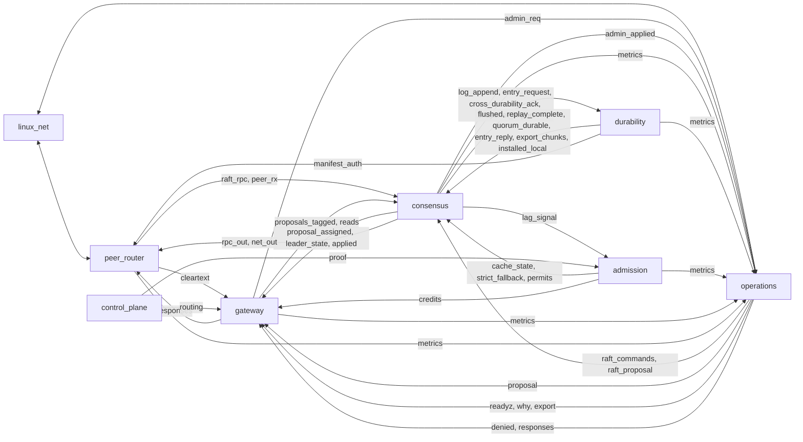

# Module Graph

Clustor is a graph of seven cooperative fluxor substrate modules,
plus `example_consumer` as a minimal downstream demo wired into the
smoke graph. The modules implement Raft consensus, durability, and
a small control plane. They ship as position-independent `no_std`
ELFs, communicate over mailbox channels, and run on the fluxor
runtime — Pi 5 hardware or a `linux` host harness. There is no
separate library layer beneath the graph.

Each module is one source tree, one `manifest.toml`, one scheduler
entity, one arena. Inside a module the work is split into
**components** — `consensus/raft.rs`, `durability/wal.rs`, and so
on — one state struct each, interacting only through
message-shaped functions with the same payloads the wire layer
uses. The module's step function is an explicit ordered dispatch
table over those components, so intra-tick delivery order is
owned in exactly one place. The practical consequence is
that a component is liftable back out into a standalone graph node
by reintroducing a manifest and replacing its message-shaped calls
with ports.

The decomposition pins each module to a single scheduling concern
with bounded step time — each component declares its own per-step
bound and the dispatch table cites them, because the ~2 ms step
guard budgets the *sum*. Modules with shared deadlines and tight
data dependencies sit on the same core; cross-core hops use
SEV/WFE-woken mailbox channels. The consensus hot path is interior: `raft → replicator →
commit → apply` runs as one fused dispatch inside `consensus`
with no scheduler dispatch and no tick boundary between the
components, and the log-append leg reaches `durability` over a
single channel hop.

---

## Module reference

### Network surface

The network stack comes from fluxor: a per-target NIC driver plus
the foundation modules `ip` and `tls`, expanded into the graph by
the `platform.net` stack. The rest are clustor's own.

| Module | Description |
|--------|-------------|
| NIC driver | The target's NIC driver, selected by the `platform.net` expansion — `rp1_gem` on Pi 5 / bcm2712 (`e810`, `virtio_net` on other targets); exchanges raw frames with the IP stack at line rate. *(fluxor driver)* |
| `ip` | TCP/UDP socket service with connection tracking; provides the transport substrate for all HTTP and Raft RPC traffic. *(fluxor foundation)* |
| `tls` | TLS 1.3 termination (ChaCha20-Poly1305, AES-GCM, P-256 ECDH) with SPIFFE identity and X.509 validation. *(fluxor foundation)* |

### `peer_router`

Multi-peer connection routing. Maps replica_id to TCP connections,
manages outbound CMD_CONNECT with reconnection backoff, demuxes
routed envelopes per peer, and splits inbound traffic between the
client path (`cleartext` → `gateway.requests`) and the peer paths
(`peer_rx` → `consensus.ack`, `raft_rpc` → `consensus.rpc`).
Outbound peer traffic arrives on `peer_tx` / `repl_tx`; client
responses on `client_resp`. `tls_identity` carries TLS-verified
`conn_id → replica_id` bindings when the TLS module is wired.

| | |
|---|---|
| Inputs | `net_in`, `peer_tx`, `repl_tx`, `client_resp`, `tls_identity` |
| Outputs | `net_out`, `cleartext`, `peer_rx`, `raft_rpc`, `metrics` |
| Params | `self_id`, `peer_count`, `listen_port`, `peer{0..4}_port`, `peer{0..4}_host` |
| Metrics | `bytes_in`, `bytes_out`, `connections.open`, `frames_dropped` |

### `consensus`

Raft leader election, log replication, quorum commit and ordered
apply. Declares `capabilities = ["replication.state_machine"]` — the
replicated state-machine role from fluxor's `capability_surface.md`,
typo-checked against the capability vocabulary. The declaration is
vocabulary, not wiring: graphs attach to the surface's ports
explicitly until a fluxor validator/resolver consumes the name.

| Component | Responsibility |
|---|---|
| `raft` | Elections with pre-vote, proposal batching, follower log matching and §5.3 conflict repair, admin/config apply, two-slot CRC metadata persistence (`RAFT<pppp>.M<slot>`). |
| `replicator` | AppendEntries pipelining to followers, ack processing, WAL read-back catch-up, snapshot chunk transfer. |
| `commit` | Fuses quorum match indices with durability acks into the commit horizon, gated on durability mode (strict / group_fsync / relaxed). |
| `apply` | Ordered, deduplicated delivery of committed entries plus the linearizable-read queue. |

The dispatch order is `raft → replicator → commit → apply`. The
hot edges between them — AppendEntries fan-out, log-body
observation, match indices, commit horizons, read probes,
committed admin/config bodies, voter-set updates — are interior
seams, not ports: producer-owned byte rings for the AE and body
fan-outs, a coalesced per-replica max array for match indices,
monotone latches for the commit horizons, and small fixed queues
for read probes. `commit` dispatches after `raft`, so the horizon
raised in step N reaches `raft` in step N+1: a deliberate one-tick
feedback, the same shape a channel edge has.

| | |
|---|---|
| Inputs | `rpc`, `proposals`, `admin_proposals`, `proposals_tagged`, `proposals_partitioned`, `proposals_partitioned_tagged`, `snapshot_installed`, `wal_flushed`, `wal_replay_complete`, `ack`, `snapshot_rx`, `durable`, `cp_state`, `read_permits`, `read`, `entry_reply` |
| Outputs | `rpc_out`, `net_out`, `log_append`, `metrics`, `proposal_assigned`, `leader_state`, `admin_applied`, `wal_compact`, `lag_signal`, `snapshot_import`, `snapshot_request`, `cross_durability_ack`, `retention_floor`, `committed_entries`, `applied`, `entry_request` |
| Params | `self_id`, `voter_count`, `election_timeout_ms`, `heartbeat_interval_ms`, `proposal_batch_max`, `proposal_batch_timeout_ms`, `partition_id`, `root_path`, `peer_count`, `pipeline_depth`, `durability_mode`, `persist_meta`, `name_fence` |

Two inputs and one output are shared handles with an in-module
demux, because fluxor caps a module at 16 ports per direction:

- `cp_state` carries both admission signals — `MSG_CACHE_STATE` to
  `commit`, `MSG_FALLBACK_SIGNAL` to `raft`. Both `admission`
  outputs wire here and fan in.
- `entry_request` / `entry_reply` serve both WAL read-back
  consumers. Request ids with bit 31 set belong to the `apply` component's gap
  refetch; the bit-31-clear half belongs to the `replicator`
  component's catch-up read-back.

`consensus` requires an `fs` write contract: `raft` persists term,
`voted_for` and the durable index/term pair to two CRC-protected slot
files, `RAFT<pppp>.M<slot>` (root-level 8.3 names when
`root_path = 1`) or `raft/meta<slot>` otherwise, with the `raft/`
parent created at first persist. A persist failure
is counted (`meta_write_errors`), logged once, and withholds vote
grants and election starts until the store recovers. Setting
`persist_meta = none` disables metadata persistence deliberately:
the agreement-only posture described in
[replication.md](replication.md#agreement-without-durability),
paired with the durability module's `volatile` variant and
`durability_mode = relaxed`.

### `durability`

Write-ahead log, quorum durability ledger, snapshots and key
epochs.

| Component | Responsibility |
|---|---|
| `wal` | Segment-file WAL: CRC32C framing, replay, group/async-fenced fsync, truncation, compaction, gap-refetch serving. |
| `ledger` | Per-replica durable indices → quorum durability proofs. |
| `snapshot` | Manifest persistence, chunked install transfer, retention floors, app-snapshot round trip. |
| `keys` | DEK epoch rotation; hands the current epoch to `wal` and `snapshot`. |

Dispatch order is `keys → wal → ledger → snapshot`. `wal`'s
durable high-water and its rotation trigger land in monotone
latest-wins latches drained between components, so ledger progress
and snapshot triggering are placed at the durability points
themselves rather than behind channel capacity.

| | |
|---|---|
| Inputs | `entries`, `entry_request`, `compact_before`, `ack`, `import_chunks`, `trigger`, `install_request`, `retention_floor`, `app_snapshot_body` |
| Outputs | `flushed`, `replay_complete`, `entry_reply`, `compaction_signal`, `metrics`, `quorum_durable`, `export_chunks`, `manifest_auth`, `installed_local`, `app_snapshot_ctl`, `cert_refresh` |
| Params | `encoding`, `segment_bytes`, `partition_id`, `self_id`, `fsync_mode`, `group_window_ms`, `group_max_pending`, `root_path`, `skip_replay`, `fixed_segment`, `preallocate_settle_ms`, `fence_depth`, `voter_count`, `name_fence` |
| Variants | `disk` (default), `volatile` |

`disk` is the durable composition: FS-backed segments and
snapshots, quorum proofs on `quorum_durable`. `volatile` selects
the WAL's in-memory retention at compile time, skips replay, and
**compiles the ledger component out** — `ack` and `quorum_durable`
are absent from its port set, so a volatile composition cannot
emit a durability proof. Acknowledgements on `flushed` mean
replicated-volatile at best, and graph validation rejects a
wiring that expects a proof from a volatile node.

`partition_id`, `self_id` and `root_path` are shared across all
four components, so the on-disk layout for segments and snapshots
is chosen once per module rather than per component.

### `gateway`

Client envelope routing, framing/correlation and admission.

| Component | Responsibility |
|---|---|
| `surface` | Demuxes inbound clustor wire envelopes from `peer_router` to the raft-RPC, client and admin routes; frames outbound responses, rejects and telemetry payloads back to the wire. Not an HTTP parser — `operations` owns HTTP framing. |
| `codec` | Request framer and `conn_id` correlation hub: stamps correlation ids (dense from 1, bit 63 clear), binds them to assigned WAL indices, applies leader redirect and placement-epoch fencing. |
| `throttle` | Credit-based admission. Consumes credits from `admission` and rejects or admits requests against the throttle envelope. |

Dispatch order is `codec → throttle → surface`, and the client
path runs `surface → codec → throttle` **within one step**: every
frame the module consumes has a terminal route in that same step —
admitted, rejected, or structurally dropped — so no consumed
proposal is ever held. An unwired `credit_supply` means unlimited:
a graph with no admission module runs the gateway unthrottled by
design, rather than inheriting a hidden bootstrap ceiling.

| | |
|---|---|
| Inputs | `requests`, `admin_responses`, `readyz_data`, `why_data`, `metrics_data`, `applied`, `placement`, `proposal_assigned`, `leader_state`, `credit_supply`, `proposals`, `client_requests` |
| Outputs | `raft_rpc`, `responses`, `admin_req`, `proposals_tagged`, `rejected`, `reads`, `metrics` |
| Params | `self_id`, `min_epoch` |
| Metrics | `requests_admitted`, `requests_rejected` |

`proposals` is the external injection point for already-correlated
traffic: bench drivers and the `operations` module's `/propose` and
admin-PROPOSE bridges feed it, and it is admitted through the same
throttle as wire-side client traffic. `client_requests` is the
intake for producers that own their own connection namespace and
have already demuxed the request — `[conn_id:u8][body]` framed as
`MSG_CLIENT_PROPOSAL` or `MSG_CLIENT_READ_REQUEST`, drained in the
dispatch table after `surface` and handed straight to the codec.
Replies to all three intakes leave on `responses` through the
codec's correlation rings.

### `admission`

Control-plane proof freshness, linearizable-read gating and flow
control.

| Component | Responsibility |
|---|---|
| `proof_cache` | CP proof age ladder (Fresh / Cached / Stale / Expired); publishes transitions and the strict-fallback signal when proofs age past the grace period. |
| `read_gate` | Issues standing linearizable-read permits while the cache is Fresh or Cached; withholds them during strict fallback. |
| `flow` | Dual-token PID admission controller (entry credits + byte credits) driven by replication lag; publishes credits, carrying the throttle envelope on the same `credits` path. |

Dispatch order is `proof_cache → read_gate → flow`; a ladder
transition is delivered into the read gate in the same step it
happens, so the permit state can never lag the cache state by a
tick.

| | |
|---|---|
| Inputs | `proof`, `input`, `lag` |
| Outputs | `cache_state`, `fresh_state`, `strict_fallback`, `permits`, `credits`, `metrics` |
| Params | `entry_credit_max`, `byte_credit_max_kib`, `sample_period_ms`, `entry_rate_per_sec`, `fresh_threshold_s`, `grace_period_s` |
| Metrics | `entry_credits`, `byte_credits` |

`proof` and `input` are the same contract on two attach points, as
are `cache_state` and `fresh_state`. Deployments differ in which
name they wire; all four are part of the published surface.

### `control_plane`

| Component | Responsibility |
|---|---|
| `cp` | Periodic control-plane proofs on a fixed 5 s refresh tick (`REFRESH_FRESH_MS`), plus tenant records and capability manifests. |
| `placement` | Epoch-based partition-to-node routing and kpg-keyed epoch events. |

Both components are pure timer-driven sources; the module has no
inputs. Its `metrics` output carries only per-component step
accounting, not data-plane telemetry.

| | |
|---|---|
| Outputs | `proof`, `tenant_records`, `capabilities`, `routing`, `epoch_events`, `metrics` |
| Params | — |

`tenant_records`, `capabilities` and `epoch_events` are optional:
graphs without tenancy or session fencing leave them unwired.

### `operations`

Admin admission, admin workflows, telemetry aggregation and the
HTTP diagnostic surface.

| Component | Responsibility |
|---|---|
| `rbac` | Evaluates RBAC roles (Operator / TenantAdmin / Observer / BreakGlass) by SPIFFE-SVID prefix match against `admin_svid_prefix` / `observer_svid_prefix` — an admin match grants Operator plus BreakGlass; writes the audit stream on `audit_events`. |
| `admin` | Idempotency-keyed admin envelope. Routes `FREEZE` / `THAW` / `TRANSFER_LEADER` / `DURABILITY_MODE` / `SNAPSHOT` to `consensus` and replies `ADMIN_STATUS_OK` / `ADMIN_STATUS_DUPLICATE`. `ADD_VOTER` / `REMOVE_VOTER` return `ADMIN_STATUS_UNSUPPORTED`; the joint-consensus path is documented in [lifecycle.md](lifecycle.md#membership-changes-and-joint-consensus). |
| `telemetry` | Metrics fan-in with fixed histogram buckets, incident correlation under a storm guard, feature-gate state, and the `/readyz` / `/why` / `/metrics` payloads. |
| `http` | Maps parsed requests to op codes and frames replies; serves `/readyz`, `/why`, `/metrics`, `POST /admin/<op>` and `POST /propose`. |
| `ingress` | HTTP/1.1 listener and parser on a dedicated `linux_net` port — by convention `LISTEN_PORT + 10000`. See [../net_http.md](../guides/net_http.md). |

Every admin command is admitted through `rbac` and there is no
path around it. Wire commands arriving on `admin_req` are
evaluated against identity bindings; `POST /admin/<op>` evaluates
as `default_role`, because HTTP carries no peer identity, and is
denied with 403 when that role is insufficient. `admin_requests`
accepts pre-authorized commands from a graph that runs its own
admission upstream. The decision is externally observable on both
sides: `denied` carries the refusals and `authorized` tees the
commands that passed, carrying the same `MSG_ADMIN_COMMAND` bytes
the `admin` component received. The tee is best-effort — dropped
on backpressure — and is never in the path of that delivery.

Dispatch order is `telemetry → rbac → admin → http → ingress`,
with the http and ingress caches refreshed from telemetry's fresh
payloads on each emit tick. A parsed request delivers into `http`
in the same step `ingress` parses it, and an authorized command
delivers into `admin` in the same step `rbac` admits it.

| | |
|---|---|
| Inputs | `admin_req`, `identity`, `admin_applied`, `admin_requests`, `ingest`, `net_in`†, `proposal_assigned`†, `applied`†, `proposal_rejected`†, `request`† |
| Outputs | `responses`, `denied`, `audit_events`, `raft_commands`, `raft_proposal`, `readyz`, `why`, `export`, `net_out`†, `proposal`†, `authorized`, `response`† |
| Params | `admin_svid_prefix`, `observer_svid_prefix`, `default_role`, `emit_interval_ms`, `listen_port` |
| Variants | `diag` (default), `headless` |

† Present in the `diag` variant only.

`request` / `response` serve a consumer that terminates HTTP on
its own shared client port rather than this module's dedicated
listener: `MSG_HTTP_REQUEST` `[conn_id][method][path_len][path]
[body]` in, `MSG_HTTP_RESPONSE` `[conn_id][status:u16]
[body_len:u16][body]` out, feeding the same request handling the
listener does. A `conn_id` bitmap records which source each live
request came from so a reply always egresses the way its request
arrived; the two sources share one `conn_id` namespace, so a graph
wires the listener or these ports, not both over overlapping ids.

`diag` carries the full HTTP diagnostic surface. `headless`
compiles the `http` and `ingress` components out and omits their
ports entirely; readiness and metrics still publish on `readyz`,
`why` and `export`, so a deployment that must not expose HTTP
selects the variant rather than trusting a config flag.
`operations` declares the `monitor` capability so `telemetry` can
pull the kernel-scope step-time histogram over the monitor
syscall; without it, bare-metal EL0 enforcement denies the call
and the step histogram is silently empty.

### Standalone modules

These are not part of any composite. `session_directory` joins
none because it internalizes no edge inside one; the bench drivers
and the example consumer are driver-side.

| Module | Description |
|--------|-------------|
| `session_directory` | Session directory / reservation authority: single-writer session bindings, quorum-committed counter-block grants, wrapped-key custody, fence ordering, and unsafe-recovery voiding, as a replicated consumer over `modules/common/session_registry.rs`. Replies only from the committed-entry stream. See [session_directory.md](session_directory.md). |
| `partition_router` | Routes proposals to the correct per-partition `consensus` instance by partition id, preserving the correlation prefix on tagged proposals. |
| `consensus_bench` | Load injector and scrape driver for the consensus path (bench graphs only). |
| `nvme_bench` | Device-floor and WAL-path storage driver (bench graphs only). |
| `example_consumer` | Minimal downstream consumer module that `#[path]`-includes `modules/common/replica_facade.rs` and wires to `consensus.committed_entries`; building it alongside the palette proves the facade stays `no_std`-clean. See [consumer_facade.md](consumer_facade.md). |
| `clustor_cli` | The operator CLI as a fluxor cli-applet: one PIC module behind `fluxor exec clustor -- <cmd>` (graph + workload manifest in `packaging/cli/`). `crc`, `wal-frame`, and `wal-scan` run the same Crc32c core and frame validation the `durability` module runs at replay, so a `wal-scan` reports exactly the durable prefix a replica would recover. |

---

## Graph definition

The canonical graph definition is embedded in
[the run guide](../guides/running.md). It enumerates:

- **7 substrate modules** — `peer_router`, `gateway`, `consensus`,
  `durability`, `control_plane`, `admission`, `operations` — with
  no execution-domain block; every module runs in the default
  domain.
- **The full edge set**, grouped by concern: `linux_net` ↔
  `peer_router` (no TLS in this config), peer_router → application
  routes, HTTP routing, the client pipeline, the HTTP `/propose`
  bridge (`operations.proposal` → `gateway.proposals`,
  `consensus.proposal_assigned` → `operations.proposal_assigned`,
  `gateway.rejected` → `operations.proposal_rejected`,
  `consensus.applied` → `operations.applied`), flow control, Raft
  replication, persistence, commit → apply, snapshots, keys,
  control plane, admin, telemetry, and the HTTP diagnostic
  surface.
- **Platform integration** via `platform: net: {}`, which injects
  the target's network module (`linux_net` on the host harness);
  `peer_router` wires to it directly.
- **Response path:** `consensus.applied` → `gateway.applied` →
  `gateway.responses` → `peer_router.client_resp` → `linux_net`
  → client. Throttle rejects (`MSG_CLIENT_REJECT`) ride the same
  path, framed by the gateway's surface component.

The yaml is the authoritative module list and edge set; per-module
port contracts live in each module's
[`manifest.toml`](../../modules/app/).

The graph is intentionally cyclic. `accept_cycles: true` tells
fluxor's `prepare_graph` to route the remaining feedback edges via
the end-of-tick fixed point: `consensus ⇄ durability` (append →
flush → durable → commit) and `consensus ⇄ peer_router`
(AppendEntries → response). Those two are the whole of it — the
raft election and commit-feedback cycles are in-module control
flow, not graph edges.



---

## Four-domain core layout (design target)

The intended layout partitions the graph across four execution
domains so the consensus hot path never waits for a tick boundary.
**No shipped config wires this yet.** The only configs that define
execution domains (`single-pi5-throughput.yaml` and its siblings)
define a single `main` domain on core 0; a second Pi 5 execution
domain currently fails the boot/readiness gate on this firmware.

| Core | Domain | Tier | Modules | Rationale |
|------|--------|------|---------|-----------|
| 0 | ops | Tier 0, 1ms | `operations`, `control_plane` | Neither is latency-critical. A 1ms tick is fine for CP proof refresh (5s intervals), admin operations, telemetry aggregation, and the HTTP diagnostic surface. |
| 1 | consensus | Tier 3, poll | `consensus`, `durability` | The persistence pipeline must never wait for a tick boundary. Poll-mode steps continuously: log append → WAL write → group fsync → durability ack → commit advance. Everything except the append hop is interior to one of the two modules. |
| 2 | network | Tier 3, poll | NIC driver (`rp1_gem`), `ip`, `tls`, `peer_router` | `peer_router` sits with the network stack so an AppendEntries dispatch is a single channel write followed by immediate TLS framing and NIC TX. |
| 3 | apply | Tier 1, 250µs | `gateway`, `admission` | 250µs tick gives a 4 kHz client-admission rate. The flow controller and the throttle are one hop apart — the credit path is `admission.credits` → `gateway.credit_supply` — and the admitted proposal leaves on `proposals_tagged`. |

### Cross-domain edges

In this layout, edges between domains use CrossCore mailbox
channels with SEV/WFE hardware wake signalling. The write commit
path crosses two domain boundaries:

```
client request (apply) →[cross-core]→ consensus (consensus domain)
                                       ↓ interior dispatch
                                       raft → replicator → commit → apply
                                       ↓ one channel hop
                                       durability (consensus domain)
                                       →[cross-core]→ gateway (apply)
                                                       → peer_router (network)
```

The two crossings cost mailbox-wake latency, small against the
fsync and network legs of the same path.

---

## Hot-path properties

**Single-owner Raft state.** Each module steps single-threaded,
and the `consensus` module owns all Raft state exclusively: no
mutexes, no atomics, no contention. Fluxor's cooperative scheduling provides
the serialisation guarantee Raft requires.

**Interior consensus loop.** The `raft`, `replicator`, `commit` and
`apply` components step 1:1 with their module, in one dispatch
table, so the propose → apply → respond path costs four channel
hops end to end rather than one per stage. Step-count budgets — the
replicator's WAL read-back TTL, inflight decay, tip-probe cooldown
— are counted in module steps, which is exactly one step per
component.

**Proposal coalescing.** `raft` accumulates up to
`proposal_batch_max` client proposals per step, bounded by
`proposal_batch_timeout_ms`. One batched AppendEntries message is
emitted per peer rather than one per proposal. This amortises RPC
framing, serialisation, and WAL entry overhead across many client
writes. The default is 1 — raising it requires the committed-entry
consumer to split the entry body back into its N self-delimiting
proposals.

**Single-hop WAL path.** The `consensus.log_append` →
`durability.entries` edge is one mailbox channel hop. `raft`
frames the batched entry into a stack buffer and sends it with a
single atomic channel write (`flush_proposal_batch` in
`consensus/raft.rs`); a batch is capped at
`PROPOSAL_BATCH_CAP = MAX_ENTRY_BODY` (2048 bytes), so the copy
cost is bounded and small.

**Replication fan-out.** The `replicator` component writes to all
peer channels in a single step, and `peer_router` frames them
onward. The NIC driver (`rp1_gem` on Pi 5) then transmits all
queued frames in its next poll iteration, so the AppendEntries
RPCs for one batch leave close together.

**Per-entry fsync.** The WAL component fsyncs each appended entry
and hands the resulting durable high-water to the ledger component
through an in-module latch — placed at the durability point, so
ledger progress never depends on channel capacity. The same
watermark leaves the module on `flushed` for the consensus
fan-out leg.

---

## Backpressure as graph structure

When the WAL or fsync pipeline stalls, `durability`'s input mailbox
stays in STREAMING state (not released). `consensus`'s next step
sees `log_append` as not-ready via `channel_poll(out, POLL_OUT)`
and stops accepting proposals. Backpressure propagates upstream:
`consensus` stops reading `proposals_tagged` → `gateway`'s
`proposals_tagged` output fills → the throttle component begins
rejecting requests with throttle envelopes. The propagation is
structural (channel fullness), not imperative (credit counters
checked in application code).

## Control plane resilience

`admission`'s proof-cache ladder (Fresh → Cached → Stale →
Expired) drives strict-fallback transitions to `consensus` over
`cache_state` and `strict_fallback`, both landing on the
`cp_state` fan-in and demuxed to the commit and raft components.
When CP proofs expire, the graph degrades to strict durability
mode and blocks linearizable reads.

## Observability

Every module emits metrics through its `.metrics` output port, and
merged modules stamp a `component` label so per-component
granularity survives the merge. `operations` aggregates the fan-in
on `ingest` (best-effort, never blocking the hot path) and reports
per-component step accounting inside the module's step histogram
export. The `/readyz` and `/why` diagnostic endpoints are
first-class graph outputs. Fluxor's per-step metering exposes
consensus latency, WAL throughput and replication lag through the
same export.

## Security boundaries

mTLS termination (`tls`), RBAC evaluation (the `rbac` component of
`operations`), and key custody (the `keys` component of
`durability`) sit behind explicit boundaries. Every admin request
— wire or HTTP — traverses `rbac` before reaching the admin
component; the module's dispatch table enforces this, so no edge a
config could add routes around it. Key material flows
unidirectionally from `keys` to the WAL and snapshot components.
Break-glass authority is granted by the admin SVID-prefix match
and every admission decision is audit-logged on `audit_events`.

---

## Embedding as substrate

Applications like Quantum (MQTT broker) and Lattice (KV store)
plug into `consensus.committed_entries`. The graph exposes the full
consensus, persistence, and control-plane machinery while the
application only implements the state machine transform. The
`gateway` module can be extended with application-specific routes
by wiring additional modules to its request fan-out ports. In the
four-domain design target above, the application's state-machine
module sits in the apply domain with the gateway for low-latency
committed-entry delivery.

The ports a downstream graph may attach to are enumerated in
[../substrate_sharing.md](../guides/substrate_sharing.md). Ports are the
API; the message-shaped functions between components inside a
module carry no stability promise.

The typed integration surface for downstream consumers is the
`replica_facade` helper at
[`modules/common/replica_facade.rs`](../../modules/common/replica_facade.rs).
Consumers include it the same way they include `wire.rs` and
`types.rs` (`#[path = "../common/replica_facade.rs"] mod
replica_facade;`). The full contract — bounded/opaque command
invariants, propose lifecycle, leader-change protocol, snapshot
install layout, and read-gate predicate — lives in
[consumer_facade.md](consumer_facade.md).
